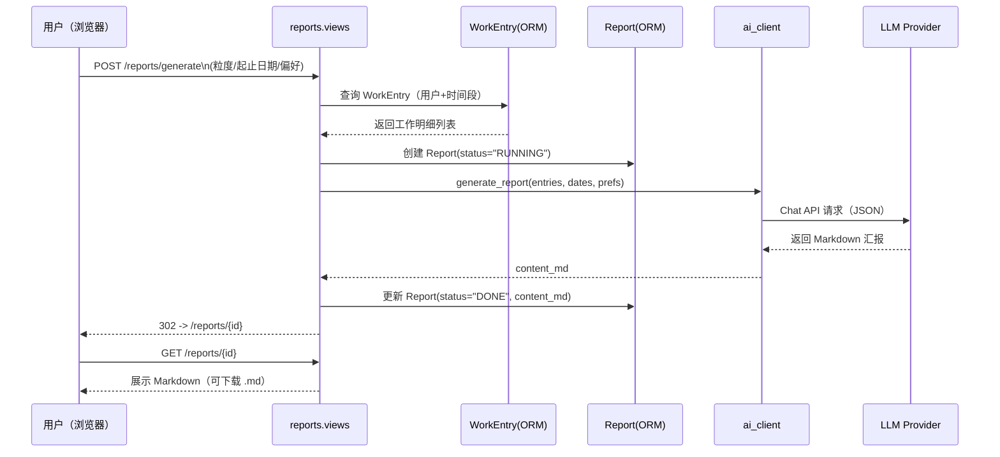
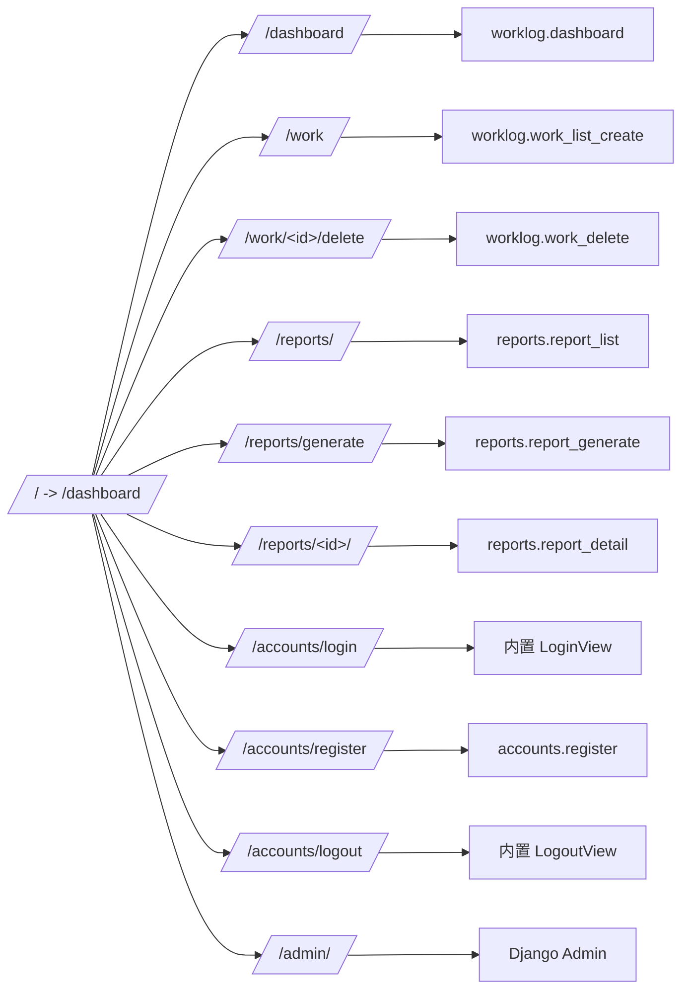

# 系统架构说明

本文档用 Mermaid 图展示项目的组件结构、关键流程、数据模型与路由映射。

## 架构总览
```mermaid
flowchart TD
    A[浏览器\nBootstrap 页面] -->|HTTP| B(Django 5 应用)

    subgraph PROJ[workreport 项目]
      G[settings.py\nAUTH_USER_MODEL\nREST_FRAMEWORK\nLLM_PROVIDER] --> J[.env 环境变量]
      F[templates:\nbase, accounts, worklog, reports]

      subgraph ACC[apps.accounts]
        ACC1[models.User\n(邮箱登录)]
        ACC2[views:\nregister, user_list]
        ACC3[urls:\n/accounts/...]
      end

      subgraph WL[apps.worklog]
        WL1[models.WorkEntry]
        WL2[views:\ndashboard, work_list_create, work_delete]
        WL3[urls:\n/dashboard, /work, /work/&lt;id&gt;/delete]
      end

      subgraph REP[apps.reports]
        REP1[models.Report]
        REP2[views:\nreport_generate, report_detail, report_list]
        REP3[services/ai_client.py\n(DeepSeek / OpenAI)]
        REP2 --> REP3
      end
    end

    B -->|ORM| H[(SQLite: db.sqlite3)]
    REP3 -->|HTTP JSON| L[LLM Provider\nDeepSeek 或 OpenAI]
```

## 关键流程：AI 汇报生成


## 数据模型（ER）

```mermaid
erDiagram
    USER ||--o{ WORKENTRY : "1:N"
    USER ||--o{ REPORT    : "1:N"

    USER {
      int id PK
      string email "唯一登录名"
      string password_hash
      string first_name
      string last_name
      boolean is_active
      boolean is_staff
      boolean is_superuser
      datetime date_joined
      datetime last_login
    }

    WORKENTRY {
      int id PK
      int user_id FK
      date date
      time start_time
      time end_time
      string title
      text content
      int duration_minutes
      datetime created_at
      datetime updated_at
    }

    REPORT {
      int id PK
      int user_id FK
      string granularity  "daily/weekly/monthly/yearly/custom"
      date start_date
      date end_date
      text prompt_prefs
      text content_md
      string status     "PENDING/RUNNING/DONE/ERROR"
      datetime created_at
    }
```


## 路由与视图映射

